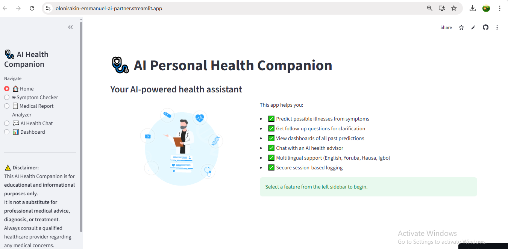
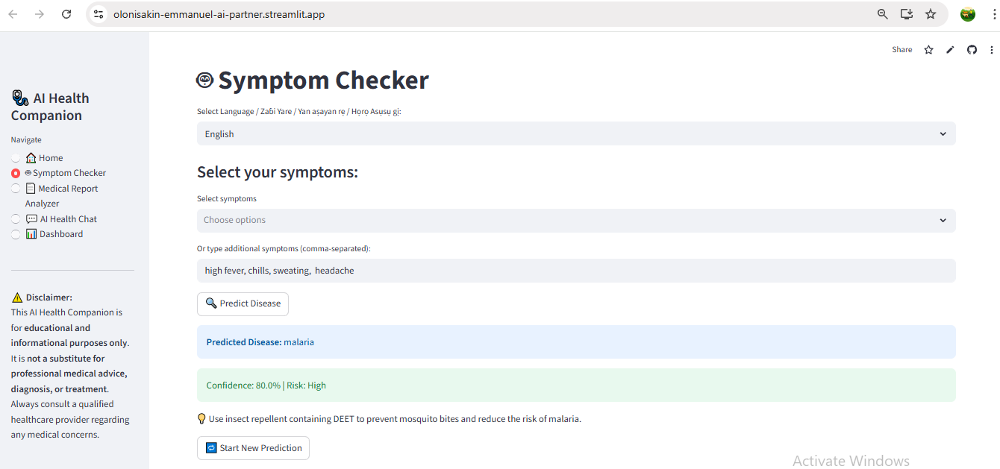
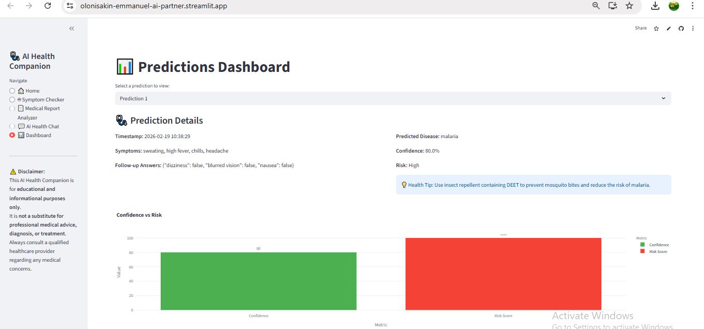
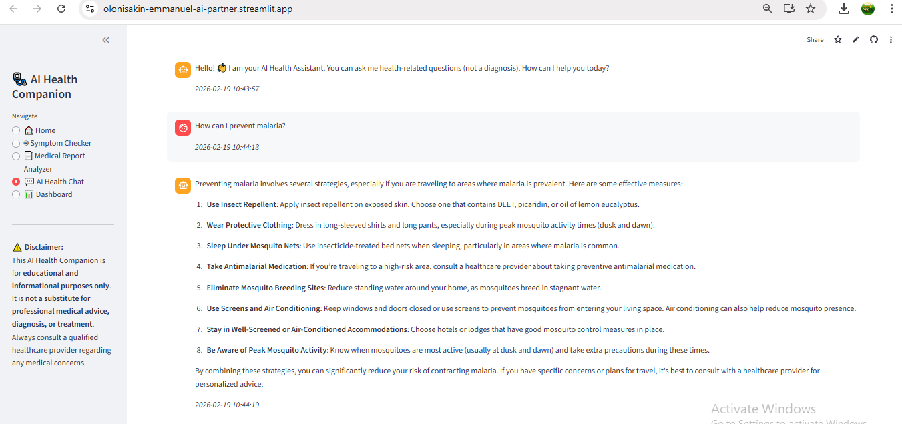
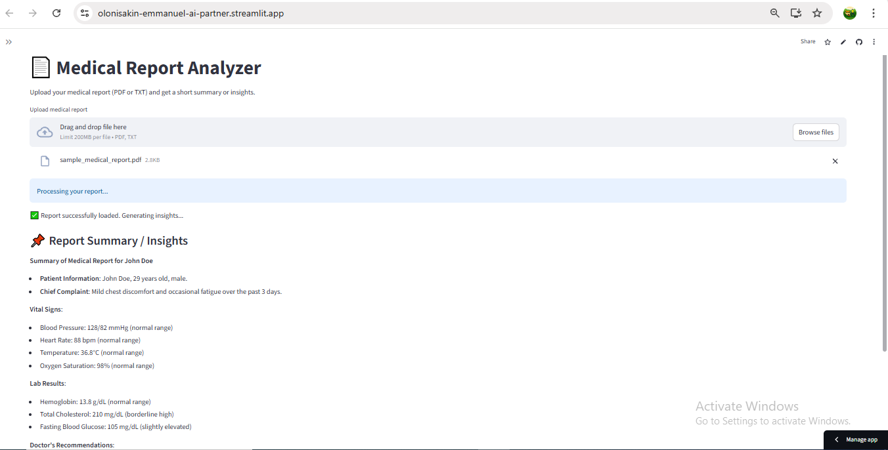

# 🩺 AI Personal Health Companion

An AI-powered health assistant that predicts possible illnesses from symptoms, analyzes medical reports, provides multilingual AI health chat support, and visualizes prediction history through an interactive dashboard.

🌍 **Live App:**  
👉 https://olonisakin-emmanuel-ai-partner.streamlit.app/

---

## 🚀 Features

- 🤖 Symptom-based disease prediction
- 📊 Interactive predictions dashboard
- 💬 AI Health Chat Assistant
- 📄 Medical Report Analyzer (PDF/TXT)
- 🌍 Multilingual support (English, Yoruba, Hausa, Igbo)
- 🔐 Session-based logging
- ☁️ Deployed on Streamlit Community Cloud

---

## 🖼️ Application Preview

### 🏠 Home Page


---

### 🤖 Symptom Checker (After Prediction)


---

### 📊 Predictions Dashboard


---

### 💬 AI Health Chat Assistant


---
### 🩺 Medical Report Analyzer


---

## 🧠 How It Works

### 1️⃣ Symptom Checker
Users select symptoms or enter custom symptoms.  
The system:
- Processes symptoms
- Predicts possible disease
- Calculates confidence score
- Assigns risk level
- Provides AI health tips

---

### 2️⃣ Dashboard
- Displays previous predictions
- Shows confidence vs risk visualization
- Tracks session logs

---

### 3️⃣ AI Health Chat
- Users ask health-related questions
- Responses generated using OpenAI API
- Supports multiple Nigerian languages

---

### 4️⃣ Medical Report Analyzer
- Upload PDF or TXT medical reports
- AI summarizes key findings in simple language

---

## 🛠️ Tech Stack

- **Python**
- **Streamlit**
- **Pandas**
- **Plotly**
- **OpenAI API**
- **Scikit-learn**
- **PyPDF2**

---

## ⚙️ Installation (Run Locally)

```bash
git clone https://github.com/Olonisakin-Emmanuel/AI-Personal-Health-Companion.git
cd AI-Personal-Health-Companion
pip install -r requirements.txt
streamlit run app/app.py

